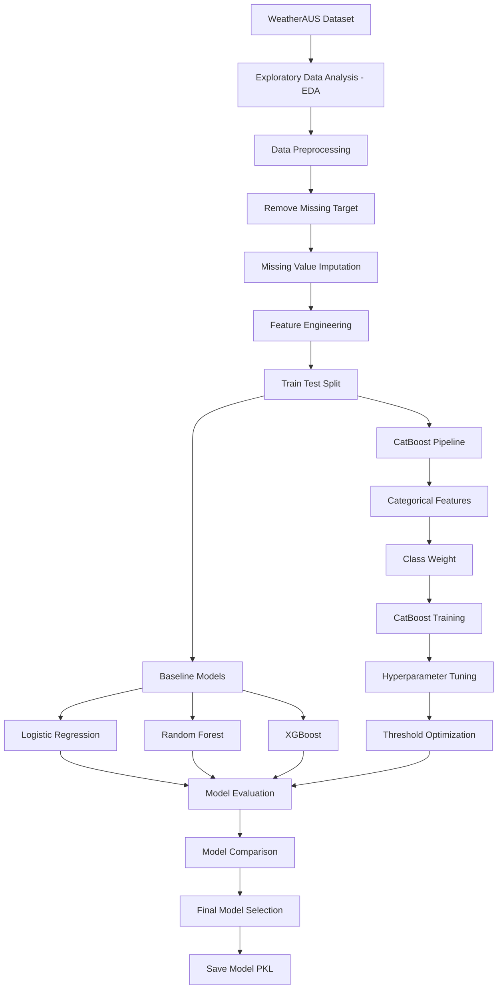

# 🌧️ Rain Tomorrow Prediction using Machine Learning

## 📌 Deskripsi Proyek

Proyek ini bertujuan untuk membangun model machine learning yang mampu memprediksi apakah akan terjadi hujan pada hari berikutnya (**RainTomorrow**) berdasarkan kondisi cuaca hari ini. Dataset yang digunakan adalah **WeatherAUS (Rain in Australia Dataset)** yang berisi data historis cuaca dari berbagai lokasi di Australia.

---

## 🏗️ Architecture / Pipeline



---

## 📂 Struktur Project

```
AustraliaRainPrediction/ 
├── data/
│      weatherAUS.csv
├── notebook/
│      rain_prediction.ipynb 
├── model/
│      final_catboost_model.pkl 
│      final_threshold.pkl  
├── README.md
├── requirements.txt
└── .gitignore
```

---

## 🚀 Cara Menjalankan

### 1. Clone Repository

```bash
git clone https://github.com/RandiBro234/AustraliaRainPrediction
```

### 2. Install seluruh dependency

```bash
pip install -r requirements.txt
```

### 3. Jalankan notebook

```bash
jupyter notebook
```

Kemudian buka:

```
rain_prediction2.ipynb
```

dan jalankan seluruh cell secara berurutan.

---

## ⚙️ Tahapan Proyek

- Exploratory Data Analysis (EDA)
- Data Cleaning
- Missing Value Imputation
- Feature Engineering
- Train-Test Split
- Baseline Model Training
- CatBoost Training
- Hyperparameter Tuning
- Threshold Optimization
- Model Evaluation
- Model Comparison
- Save Final Model

---

## 🧠 Feature Engineering

Fitur baru yang dibuat:

- TempRange
- PressureDiff
- HumidityDiff
- AvgTemp
- AvgPressure
- AvgHumidity
- WindSpeedDiff

---

## 🤖 Model yang Diuji

- Logistic Regression
- Random Forest
- XGBoost
- XGBoost + SMOTE
- CatBoost
- CatBoost + Hyperparameter Tuning
- CatBoost + Hyperparameter + Threshold Optimization

---

## 🏆 Final Model

Model terbaik:

**CatBoost + Hyperparameter Tuning + Threshold Optimization**

Threshold terbaik:

```
0.59
```

Hasil evaluasi:

| Metric | Score |
|---------|------:|
| Accuracy | 85.84% |
| Precision | 67.42% |
| Recall | 71.26% |
| F1 Score | 69.29% |
| ROC AUC | 90.65% |

---

## 📊 Insight

- Dataset memiliki distribusi kelas yang tidak seimbang sehingga penanganan imbalance dilakukan menggunakan **Class Weight** pada CatBoost.
- Feature engineering membantu menangkap informasi tambahan seperti perubahan suhu, tekanan udara, dan kelembapan sehingga meningkatkan kualitas prediksi.
- Dibandingkan Logistic Regression, Random Forest, dan XGBoost, **CatBoost memberikan performa terbaik** karena mampu menangani fitur kategorikal secara langsung tanpa memerlukan One-Hot Encoding.
- Hyperparameter tuning meningkatkan kemampuan model dalam membedakan kelas, sedangkan threshold optimization menghasilkan keseimbangan precision dan recall yang lebih baik.

---

## 📦 Dependencies

Seluruh library yang diperlukan tersedia pada file:

```
requirements.txt
```
